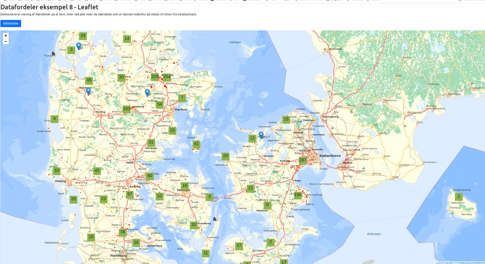

# mapevents
Viser hvordan man bruger hændelser fra Datafordeler på et kort

## Beskrivelse

Demonstration på hvordan man kan vise hændelser fra Datafordeler på et kort



## Installation og konfiguration

Man skal oprette en web-bruger og en eller flere tjenestebruger på Datafordeler selvbetjeningsportal (https://selfservice.datafordeler.dk/)

Brugernavn for den tjenestebruger, som bruger til at hente Skærmkort fra Datafordeler, skal oprettes i filen

auth.js

```javascript
var username = 'XXXXX'
var password = 'YYYYY'
```

XXXXX er det oprettede tjenestenavn og YYYYY er det tilhørende password.

## Start i docker

```
docker run -p 2000:80 -v .:/usr/share/nginx/html nginx:alpine
```

gaa derefter ind paa http://localhost:2000 i den browser.
